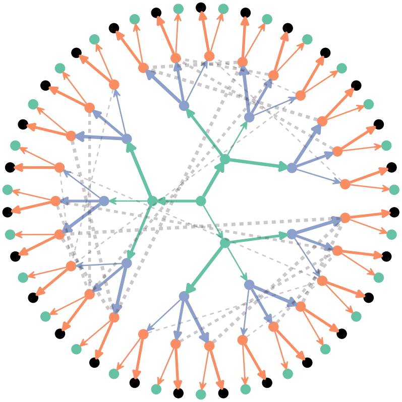

# Notes

## Initial thoughts

Things to think about:

1. Changing the structure of the game
	-	Self stigma
		-	Changes the information sets (each signaller in own set)
		-	Changes learning, signallers learning only about referral
		-	More complex for the receivers - more effective types
	-	Number of rounds
		- Not clear that there's regularity, or a fixed number of appointments
	-	Players
		-	Obvious choice is social workers
		-	Family might make more sense though - payoffs more difficult
2. What do the payoffs correspond to in real life
	-	Utility and disutility
	-	Utility of living well
	-	Utility of company
	-	Disutility of admitting need
		-	Being a burden
		-	Who you are admitting it *to*
	-	Cost of care
	-	Once again, there's a strong temporal dynamic here. Pay now, win later.
3. What do the beliefs correspond to?
	-	Belief that help will actually be delivered
	-	Belief that help is actually needed/not needed
		-	Is self-stigma overriding need
	-	Belief about what the payoffs will actually be... Impossible outcomes (being stigmatised)
		-	Raises the question: does stigma need to actually happen for belief in it to persist?
4. How do you work out the payoffs?
	-	Revealed preference? (Costs of care per hour are knowable)

## Themes

-	Resignation
	-	Age attribution
	-	Lack of belief in outcomes
-	Low expectations
-	Declining offered help
-	Lack of information

## Initial experiments

Going on the CLC unmet need briefing paper.. Two 'types' need, severe need (2+ ADLs). ELSA data says ~ twice as likely to get help if severe. GHS says it depends on what they need help *with*. BHPS is a bit hazy.

What is clear - would be looking for crisp differentiation between mid and high types.

If we assume social worker/gp assessment.. We'd be talking about (state) formal care. 

What if we set it up so that the current state of play is the *start* point. See if it can be sustained, see if it can be made worse/better.

### ELSA Data

We have proportions - say, 16.2 (9.7+6.5) single need, 9 severe need.

Would be looking for a scenario where around 2/3 of single need get no help, vs. 1/3 of severe. Calibration?

## New measures

This would make it important to monitor beliefs better. Should also add a population wide median measure.

## Information sets

## Simple Scenario

Assume an amalgam of assessors - family, GPs, social workers etc. This would imply heterogeneous beliefs. Assume that we take a brief period of time - we're interested in these people for a year (monthly assessments).

Assessors are to be divisible by payoffs matrix - the matrix on their side represents an amalgam across the groups. Approach as a calibration process - looking for a scenario that leads to 2/3 single need unreferred, 1/3 severe need referred. Don't change the game at all - let stigma continue to be 'endogenous' to the receivers, but consider simply letting that not exist. Model based reasoning mismatch.

Use the ELSA parameters for proportions.
